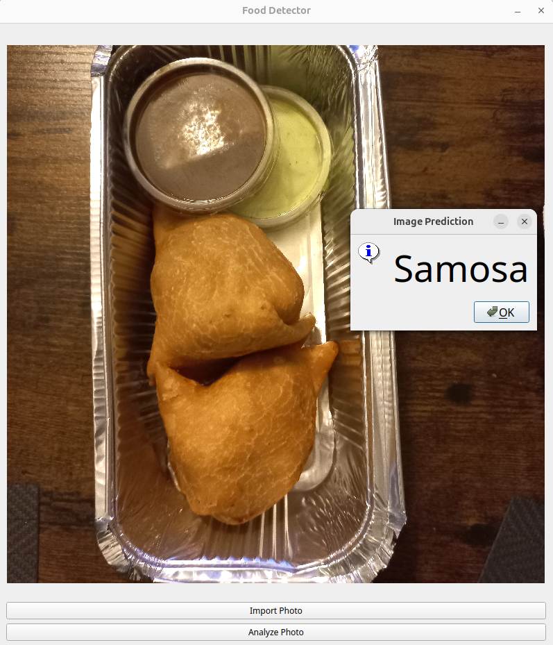

This project was initially completed as a final assignment for a university course on multimedia data analysis. The main objective was to develop a DNN classifier capable of efficiently recognizing various dishes from images, leveraging fine-tuned pretrained models. The project utilized the Food101 dataset, which consists of 101,000 images representing 101 types of food. Since the dataset contained some incorrect images, it was manually cleaned, with over 900 faulty entries removed.

Given the constraint of limited computational resources, the project focused on small-scale models (approximately 20 million parameters or fewer). After evaluating several options, the EfficientNetV2S model was selected as the most promising, and fine-tuning it resulted in an accuracy of 83.5%. To make the model accessible and user-friendly, its functionality was implemented in a simple desktop application.



Beyond the technical implementation, an error analysis was conducted to examine the model's most frequent misclassifications. While this analysis is still being refined as a personal side project "for fun," it has the potential to provide valuable insights for building even better models in the future.

The entire project, including its progress and structure, is documented across a series of Jupyter notebooks. A significant portion of the code is modularized within the src directory.

Environment setup:
```bash
# create python environment
python3 -m venv .food101

# activate environment
source .food101/bin/activate

# install dependencies
pip install -r requirements.txt

# create jupyter environment kernel
python -m ipykernel install --user --name=food101
```